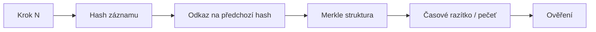

# GLJA EUROPE

**Global Level of Justice Auditor**

Nezávislá LegalTech/GovTech platforma pro procesní audit — ověřujeme, zda byl při rozhodnutí, usnesení nebo rozsudku dodržen správný procesní postup, a výsledek kryptograficky zapečetíme.

🌐 **https://www.glja.cz**

| | |
|---|---|
| **Stav** | 🟡 Aktivní vývoj / Alpha |
| **Licence** | Proprietary |
| **Jazyk dokumentace** | Čeština (anglické technické termíny ponechány) |

> GLJA EUROPE **není** advokátní kancelář, soud, ani poskytovatel právních služeb v žádném státě světa. Neposkytujeme právní zastoupení ani poradenství a nerozhodujeme, kdo má ve věci pravdu.

---

## Obsah

- [Proč GLJA vznikla](#proč-glja-vznikla)
- [Kdo stojí za GLJA](#-kdo-stojí-za-glja)
- [Základní myšlenka](#-základní-myšlenka)
- [Co GLJA dělá](#-co-glja-dělá)
- [Co GLJA nedělá](#️-co-glja-nedělá)
- [Technologie](#️-technologie)
- [Důkazní řetězec](#-důkazní-řetězec)
- [AI v GLJA](#-ai-v-glja)
- [Human-in-the-loop](#--human-in-the-loop)
- [Jak probíhá audit](#-jak-probíhá-audit)
- [Vstup / proces / výstup](#vstup--proces--výstup)
- [Findings](#-findings)
- [Oprava a verzování auditu](#-oprava-a-verzování-auditu)
- [Tento repozitář](#-tento-repozitář)
- [Dokumentový korpus](#dokumentový-korpus)
- [Stav projektu](#-stav-projektu)
- [Roadmapa](#️-kam-glja-směřuje)
- [Vedlejší koncept: alternativní tresty](#vedlejší-koncept-technologická-podpora-alternativních-trestů)
- [Doktrinální konstanty](#-doktrinální-konstanty)
- [Bezpečnost](#️-bezpečnost)
- [Právní postavení](#️-právní-postavení)
- [Motto zakladatelů](#motto-zakladatelů)
- [Pro koho je repozitář](#-pro-koho-je-repozitář)
- [Jak začít](#-jak-začít)
- [Vývoj a spolupráce](#vývoj-a-spolupráce)
- [Kontakt](#kontakt)

---

## Proč GLJA vznikla

Moderní rozhodnutí dnes stále častěji stojí na složitých řetězcích dokumentů, postupů, digitálních systémů a informací. Otázka přitom není vždy jen:

> „Kdo má pravdu?"

Stejně důležitá bývá otázka:

> „Dokážeme zpětně rekonstruovat, co se skutečně stalo?"
> „Dokážeme ověřit, že postup byl konzistentní?"
> „Dokážeme odlišit původní záznam od jeho pozdější úpravy?"
> „Dá se integrita auditní stopy nezávisle ověřit?"

Kolem tohoto problému GLJA vznikla. Projekt se snaží vytvořit technologickou vrstvu pro:

**Proces → Sledovatelnost → Analýza → Ověření → Integrita**

GLJA nevzniká jako kritika soudů, úřadů nebo firem — vzniká jako nezávislý nástroj, který lze nad jejich postupem použít.

## 👥 Kdo stojí za GLJA

### Roman Mužný Kašpar — Zakladatel / Architekt
Vede vývoj metodiky a technické architektury procesního auditu GLJA.

### David Mužný — Partner / spolupodepisující
Podílí se na strategickém směřování, řízení a partnerských vztazích projektu; spolupodepsal klíčové zakladatelské dokumenty (Memorandum o budoucím rozdělení podílů).

*O jejich osobních profesních životopisech mimo GLJA repozitář zatím žádné podklady nemáme — tato sekce se drží jejich role v projektu, ne osobní biografie.*

## 🧭 Základní myšlenka

GLJA nerozhoduje, co je spravedlnost. GLJA se snaží učinit **proces**, který za rozhodnutím stojí, lépe rekonstruovatelným, auditovatelným a technicky ověřitelným.

> **GLJA neměří právo. GLJA měří procesní konzistenci.**

Toto rozlišení je zásadní pro pochopení celého projektu — a je zároveň hranicí toho, co GLJA je a co není.

## 🔍 Co GLJA dělá

```
VSTUP
  ↓
Dokumenty / data
  ↓
Strukturování
  ↓
Rekonstrukce procesu
  ↓
Analýza
  ↓
AI-asistovaný přezkum
  ↓
Ověření (kvórum / shoda)
  ↓
Výsledek auditu
  ↓
Kryptografická pečeť
  ↓
VÝSTUP
```

Zjednodušeně: GLJA vezme podklady k nějakému postupu (od e-mailu či výzvy přes žalobu a smlouvu až po usnesení, rozsudek nebo exekuční titul), strukturuje je, posoudí dodržení procesních pravidel a výsledek uzamkne kryptografickým zapečetěním do neměnného záznamu.

## ⚖️ Co GLJA nedělá

- GLJA **není soud**
- GLJA **neurčuje vinu**
- GLJA **neurčuje právní odpovědnost**
- GLJA **nenahrazuje advokáty**
- GLJA **neposkytuje právní zastoupení**
- GLJA **negarantuje právní výsledek**
- GLJA **nenahrazuje soudní rozhodování**

## 🏗️ Technologie

| Technologie | Co to je | Proč to GLJA používá | Co to přináší |
|---|---|---|---|
| SHA-256 / SHA-512 | Kryptografické hashovací funkce | Detekce jakékoli změny záznamu | Ověřitelná integrita dat |
| Merkle tree | Stromová struktura hashů | Efektivní zřetězení a ověření velkého množství záznamů | Škálovatelné a ověřitelné zřetězení důkazů |
| PAdES-BASELINE-T | Standard elektronických časových razítek | Prokázání, že záznam existoval k danému okamžiku | Časová kotva pro audit |
| Offline verifikace | Ověření integrity bez nutnosti online služby | Nezávislost na dostupnosti konkrétní platformy | Trvalá ověřitelnost výstupu |
| WORM úložiště | Write-Once-Read-Many úložiště | Znemožnění dodatečné úpravy zapečetěného záznamu | Neměnnost auditní stopy |
| Microsoft Azure | Cloudová infrastruktura | Provoz a škálování platformy | Infrastrukturní základ vývoje |
| Microsoft 365 compliance/audit nástroje | Nástroje pro compliance a audit logy | Podpora interní auditovatelnosti provozu | Doplňková vrstva transparentnosti |

> **TO BE VERIFIED:** rozsah a míra produkčního nasazení jednotlivých technologií výše (které běží v produkci vs. které jsou zatím koncepční) — bude upřesněno.

**Web3 / institucionální identita** — koncepční směr zvažovaný pro budoucí verze platformy. **PROPOSED**, není implementováno.

## 🔐 Důkazní řetězec



Kryptografický hash pomáhá prokázat, že se data nezměnila od okamžiku, kdy byla zaznamenána. **Neprokazuje** automaticky, že zaznamenaná informace byla pravdivá — integrita záznamu a pravdivost jeho obsahu jsou dvě odlišné vlastnosti. GLJA řeší tu první; o té druhé rozhoduje vždy příslušný orgán nebo soud.

## 🤖 AI v GLJA

AI je v GLJA nástroj pro analýzu a orchestraci, ne rozhodovací orgán.

| AI systém | Stav |
|---|---|
| Interní logika AI_QUORUM (jádro posouzení shody/rozporu) | 🟡 V vývoji |
| Claude | ⚪ Hodnoceno / navrhováno |
| Gemini | ⚪ Hodnoceno / navrhováno |
| GPT / ChatGPT | ⚪ Hodnoceno / navrhováno |
| Microsoft Copilot | ⚪ Hodnoceno / navrhováno |
| Meta / Llama | ⚪ Hodnoceno / navrhováno |

**Proč více modelů:** kombinace více AI systémů umožňuje porovnat jejich shodu i rozpor (model agreement/disagreement), provést křížové ověření (cross-validation) a snížit riziko, že chyba jednoho modelu (falešně pozitivní/negativní zjištění, halucinace) zůstane bez povšimnutí. Konečné slovo má vždy lidský přezkum.

`AI_QUORUM` je koncept jádra, které tato dílčí posouzení agreguje — jde o architektonický koncept projektu, jeho konkrétní implementace je ve vývoji.

## 👤 + 🤖 Human-in-the-loop

```
AI
 ↓
Analýza
 ↓
Porovnání
 ↓
Ověření
 ↓
Lidský přezkum
 ↓
Finální výstup auditu
```

Výstup AI analýzy **není** automaticky finálním závěrem auditu — prochází lidským přezkumem, než je zapečetěn.

## 📋 Jak probíhá audit

01. **Vstup** — přijetí podkladů
02. **Validace** — kontrola úplnosti a formátu
03. **Strukturování** — převod do jednotného formátu pro zpracování
04. **Rekonstrukce procesu** — sestavení časové osy a posloupnosti úkonů
05. **Analýza** — posouzení dodržení procesních pravidel
06. **AI analýza** — asistované vyhodnocení podle definované metodiky
07. **Kontrola** — porovnání dílčích výstupů, vyhodnocení shody/rozporu
08. **Findings** — identifikace zjištění
09. **Opravy** — zapracování korekcí, je-li třeba (viz níže)
10. **Finální výstup** — sestavení výsledné zprávy
11. **Zapečetění** — kryptografické zřetězení výsledku
12. **Verifikace** — možnost nezávislého ověření integrity záznamu

> **PROPOSED:** přesná automatizace a nástroje pro kroky 06–09 jsou předmětem aktivního vývoje; kroky výše popisují cílový proces, ne nutně již plně implementovaný pipeline.

## Vstup / proces / výstup

| | Popis |
|---|---|
| **VSTUP** | Dokumentace k posuzovanému postupu — e-maily, výzvy, žaloby, smlouvy, usnesení, rozsudky, exekuční tituly |
| **PROCES** | Strukturování → rekonstrukce → analýza → AI-asistovaný přezkum → lidské ověření → zapečetění |
| **VÝSTUP** | Strukturovaný výsledek auditu, identifikovaná procesní zjištění, odůvodnění postupu, kryptografická pečeť a identifikátor auditu |

## 🚨 Findings

„Finding" je konkrétní zjištění identifikované v rámci auditu, například:

- nekonzistence v postupu
- chybějící informace
- protichůdné záznamy
- chronologická nesrovnalost
- anomálie v metadatech
- procesní nesrovnalost (např. nedodržení lhůty)

**PROPOSED:** formální taxonomie závažnosti findings (severity levels) zatím není definitivně stanovena — pokud a až bude zavedena, bude zde doplněna.

## ♻️ Oprava a verzování auditu

Princip: historické stavy auditu by neměly jednoduše zmizet.

```
AUDIT v1
  ↓
Finding
  ↓
Přezkum
  ↓
Oprava
  ↓
AUDIT v2
  ↓
Nový stav / pečeť
```

**PROPOSED:** toto je architektonický směr projektu. Konkrétní implementace verzování (např. formát uchování v1/v2, propojení pečetí) je součástí probíhajícího vývoje a bude zde upřesněna, jakmile bude zavedena.

## 📁 Tento repozitář

> **[CONTENT NEEDED]** — přesná struktura adresářů tohoto repozitáře nebyla v době psaní tohoto README nezávisle ověřena (nebyl k dispozici přístup k obsahu repozitáře). Až bude k dispozici výstup `git ls-files` nebo `tree -L 2`, doplňte jej sem ve tvaru:

```text
/
├── README.md
├── ...
└── ...
```

Pro každý klíčový adresář doplňte:
- **Účel** — k čemu adresář slouží
- **Stav** — 🟢 aktuální / 🟡 ve vývoji / 🔵 plánováno
- **Důležité soubory** — na co se podívat jako první

## Dokumentový korpus

Interní dokumentace GLJA je organizována do kategorií:

| Kategorie | Obsah |
|---|---|
| **A — Manifesty** | Základní pojetí a filozofie projektu |
| **B — Governance & právní rámec** | Vlastnická struktura, memoranda, doktrinální konstanty |
| **C — Audit & interní dokumentace** | Metodika a interní postupy auditu |
| **D — Protokoly & manuály** | Provozní a technické protokoly |
| **E — Web & Dashboard** | Podklady pro veřejnou prezentaci a webové rozhraní |

**Hierarchie výkladu** (v případě rozporu mezi dokumenty):

1. Manifesty
2. Governance / právní rámec
3. Memoranda
4. Protokoly / manuály

## 🚧 Stav projektu

| Oblast | Stav |
|---|---|
| Základní metodika (procesní konzistence, CONST-004) | 🟢 Aktuální |
| Kryptografické zřetězení (SHA-256/SHA-512) | 🟢 Aktuální / implementace k ověření |
| Merkle tree evidence chaining | 🟡 Ve vývoji |
| PAdES-BASELINE-T časová razítka | ⚪ Navrhováno / k ověření |
| AI orchestrace (AI_QUORUM) | 🟡 Ve vývoji |
| Multi-model kvórum (Claude, Gemini, GPT, Copilot, Llama) | ⚪ Navrhováno / hodnoceno |
| Veřejná prezentace (web, GitHub Pages) | 🟢 Aktuální |
| Transformace na GLJA EUROPE s.r.o. | 🟡 Probíhá |
| Institucionální pilotní nasazení | 🔵 Plánováno |
| Koncept alternativních trestů | 🔵 Rané stadium konceptu |

**Fáze projektu:**

- **Fáze 1 — Základy a architektura** — probíhá (metodika, architektura, model integrity důkazů)
- **Fáze 2 — Validace dat a integrace** — [CONTENT NEEDED]
- **Fáze 3 — Institucionální pilot** — plánováno, bez konkrétního data

GLJA je aktuálně v aktivní fázi vývoje (Alpha). Fáze Alpha se soustředí na ověření metodiky, architektury a modelu integrity důkazů před širším institucionálním nasazením.

## 🛣️ Kam GLJA směřuje

- Validace metodiky
- Technický audit architektury
- Externí přezkum
- Pilotní nasazení
- Rozšíření sady AI modelů
- Ověřovací infrastruktura pro veřejnou verifikaci
- Institucionální integrace

Výše uvedené jsou plánované směry vývoje, ne potvrzené termínované závazky.

## Vedlejší koncept: technologická podpora alternativních trestů

Toto je **rané stadium konceptu**, umístěné záměrně až za hlavním produktem GLJA.

- Aktuálně **není nasazeno**.
- **Nemá právní účinnost.**
- GLJA by v tomto konceptu **nerozhodovala o vině, trestu ani propuštění**.
- Jakékoli budoucí zpracování citlivých osobních údajů v této oblasti by vyžadovalo odpovídající právní základ a řádné governance.

## 📜 Doktrinální konstanty

| Konstanta | Vysvětlení |
|---|---|
| **AUTORSTVÍ ≠ PODPIS ≠ ODPOVĚDNOST** (§ 6 Master Deed) | Autorství materiálu, jeho podpis a právní odpovědnost jsou tři oddělené kategorie; žádná z nich automaticky neimplikuje druhou. |
| **RMK-512** | Identifikátor původu/značky (provenance). Nejde o omezení odpovědnosti a nesmí být takto prezentován. |
| **EVIDENCE RULE** | [CONTENT NEEDED] — přesná formulace pravidla bude doplněna. |
| **LEGAL STATUS** | [CONTENT NEEDED] — přesná formulace bude doplněna. |
| **Axiom rovnosti (E-04)** | Jurisdikční neutralita metodiky. |

## 🛡️ Bezpečnost

Zdokumentované prvky bezpečnostní architektury:

- Kryptografické hashování (SHA-256/SHA-512)
- WORM (Write-Once-Read-Many) úložiště pro zapečetěné záznamy
- Offline verifikace integrity
- Provoz na infrastruktuře Microsoft Azure

**[CONTENT NEEDED]:** podrobnosti k řízení přístupu, správě identit a auditním logům nad rámec výše uvedeného zatím nejsou samostatně zdokumentovány pro veřejné README — budou doplněny.

Nejsou zde deklarovány žádné bezpečnostní certifikace ani nezávislé audity, dokud nebudou skutečně provedeny a zdokumentovány.

## ⚖️ Právní postavení

GLJA EUROPE je:

- **non-lawyer LegalTech infrastruktura** (technologická, ne právní služba)
- **ve vývoji** (fáze Alpha)
- zaměřena na **procesní konzistenci a auditovatelnost**
- **není** právní zastoupení ani poradenství

GLJA nepoužívá formulace typu „právní důkaz", „soudu odolný" nebo „právně nezpochybnitelný", pokud takové postavení není skutečně právně zakotveno. Kryptografická pečeť dokládá integritu záznamu — nikoli jeho právní účinek, o kterém vždy rozhoduje příslušný orgán nebo soud.

## Motto zakladatelů

> „V bohatství je pokora."

Smyslem tohoto motta je propojit technologickou schopnost s odpovědností, zdrženlivostí a transparentností — tak, jak se ji zakladatelé snaží promítnout do způsobu, jakým je GLJA budována.

## 👨‍💻 Pro koho je repozitář

Repozitář může být relevantní pro:

- vývojáře
- AI inženýry
- auditory
- právní profesionály
- specialisty na bezpečnost
- výzkumníky
- potenciální institucionální partnery
- kohokoli, kdo hodnotí metodiku GLJA

## 🚀 Jak začít

**[CONTENT NEEDED]** — dokumentace k lokálnímu vývojovému prostředí se aktuálně připravuje. Jakmile budou instalační kroky, příkazy a proměnné prostředí (bez citlivých hodnot) k dispozici, budou doplněny zde.

## Vývoj a spolupráce

Repozitář je **proprietární** (Proprietary license) — veřejné příspěvky (pull requesty) nejsou v tuto chvíli přijímány.

Pro technické dotazy nebo návrhy na spolupráci využijte kontakty níže.

## Kontakt

**Roman Mužný Kašpar** — Zakladatel / Architekt
[roman.muzny@glja.cz](mailto:roman.muzny@glja.cz)

**David Mužný** — Partner / spolupodepisující
[david.muzny@glja.cz](mailto:david.muzny@glja.cz)

**Obecný kontakt**
[glja-europe@seznam.cz](mailto:glja-europe@seznam.cz)

🌐 **https://www.glja.cz**

---

<sub>© 2026 GLJA EUROPE — Global Level of Justice Auditor. Nezávislý procesní auditor · nikoli advokátní kancelář ani soud, a to v žádném státě světa.</sub>
